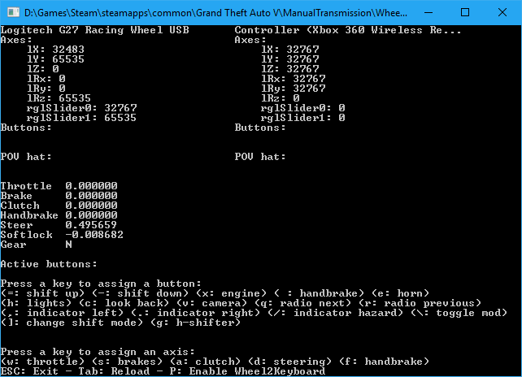

DIUtil
==============================

This DIUtil tool (DirectInput Utility) is to be used (temporarily) for 
configuration of the main mod. `WheelConfigurator.exe` should be in 
`\ManualTransmission\` along with `settings_general.ini`
and `settings_wheel.ini`.

## Usage

To use this utility, just run it and follow the onscreen instructions.
* The top blocks contain your available controllers with their raw values. 
* The middle block shows the values the game would read if you'd start the game right now.
* The bottom shows available keys at that moment to press. To configure throttle for example, press "w".

The tool automagically detects which axis or button on which device is used for input, so you only need to choose the things you want to assign.

Specifically for the H-Shifter, you do need to choose your device and you'll need to follow the onscreen instructions (shift into gear X and press Enter, etc).

## `WheelConfigurator.log`
A log is generated upon running this tool. Right now it's just useful for bug reports.

## Plans
So as you might have guessed, this is not a proper GUI! Plans have been dropped for the time being, with focus on making this tool less terrible to use. 

Since a separate executable is less than desirable, I might also start making an in-game menu to configure things, but that'll have no hurry. I'll probably leave this tool as-is whenever that idea becomes reality.

## But I want a GUI!
Feel free to make one, because I have no idea how to. `¯\_(ツ)_/¯`
