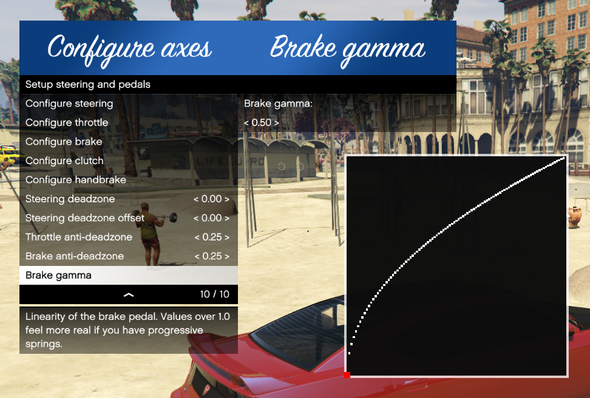

[comment]: # (User README.md)

# Manual Transmission and Steering Wheel Support for GTA V

Version 4.6.6


## Description

This mod enables manual transmission and offers various options to fine-tune
your gameplay, from gearbox selection to engine braking.

Support for steering wheels is fully integrated into this mod with full force
feedback support, support for multiple input devices and every setting is
customizable to fit your wheel and personal preferences.

## Features

* Friendly in-game menu for configuration
* Supports keyboard, controller and wheel input
* Supports for all land-based engine-powered vehicles
* Loads of options for every aspect of the mod!
* Choose between transmission systems - On the fly!:
  * Sequential gearbox
  * H-pattern gearbox
  * Custom automatic gearbox
* Engine and transmission mechanics:
  * Clutch support
  * Engine braking
  * Engine damage
  * Engine stalling

## Downloads

* [GTA5-Mods.com](https://www.gta5-mods.com/scripts/manual-transmission-ikt)
* [GitHub release (older versions)](https://github.com/E66666666/GTAVManualTransmission/releases)
* [Latest automated builds](https://ci.appveyor.com/project/E66666666/gtavmanualtransmission/build/artifacts)

## Table of Contents

* [Manual Transmission and Steering Wheel Support for GTA V](#manual-transmission-and-steering-wheel-support-for-gta-v)
  * [Description](#description)
  * [Features](#features)
  * [Downloads](#downloads)
  * [Table of Contents](#table-of-contents)
  * [Requirements](#requirements)
  * [Installation and usage](#installation-and-usage)
    * [FiveM installation](#fivem-installation)
  * [Updating](#updating)
  * [Recommended mods](#recommended-mods)
  * [Controls](#controls)
    * [Keyboard defaults (US-ANSI)](#keyboard-defaults-us-ansi)
    * [Controller defaults](#controller-defaults)
    * [Wheel defaults](#wheel-defaults)
    * [Controls priority](#controls-priority)
  * [Driving with Manual Transmission](#driving-with-manual-transmission)
  * [Configuration files](#configuration-files)
    * [`settings_general.ini`](#settings_generalini)
    * [`settings_wheel.ini`](#settings_wheelini)
    * [`settings_menu.ini`](#settings_menuini)
  * [Troubleshooting](#troubleshooting)
    * [Compatibility](#compatibility)
    * [Known generic issues](#known-generic-issues)
    * [Steering wheel issues](#steering-wheel-issues)
  * [Credits](#credits)
  * [Source code](#source-code)

## Requirements

* [Grand Theft Auto V](http://store.steampowered.com/app/271590/Grand_Theft_Auto_V/) 1.0.877.1 to 1.0.1604.0
* [ScriptHookV](http://www.dev-c.com/gtav/scripthookv/)

## Installation and usage

Put `Gears.asi` and the folder `ManualTransmission` in your GTA V folder
 (overwrite when asked).

__Additional steps for wheel users__  
Remove or disable any XInput or DirectInput input hook configurations for
your wheel for GTA V (x360ce, for example)

Use the menu hotkey (`[{`) to open the menu. Configure your preferences and
options in the menu. __Mandatory for wheel users!__

### FiveM installation

1. Create a plugins folder in FiveM Application Data
2. Put `Gears.asi` and the folder `ManualTransmission` in plugins

No official support for FiveM is given beyond this package. If you'd like to give conversion to server or FiveM itself a try, I'll try helping where I can.

## Updating

Replace `Gears.asi` and the folder `ManualTransmission` in your GTA V folder.
If the changelog indicated settings changed, you might want to
check the options. Otherwise it should be fine to keep `settings_wheel.ini`,
 `settings_general.ini` and `settings_menu.ini`.

## Recommended mods

You might want to install some additional mods to enhance your experience.

Any speedometer supporting RPM/Gear reading from memory:

* [NFS Speedo](https://www.gta5-mods.com/scripts/nfsgauge-rpm-gear-speedometer)
* [LeFix Speedometer](https://www.gta5-mods.com/scripts/speedometer-improvedalexbladeversion)
* [NFSU Speedometer](https://www.gta5-mods.com/scripts/need-for-speed-underground-speedometer)

Any handling mod that aims to improve handling accuracy:

* [Realistic Driving V](https://www.gta5-mods.com/vehicles/realistic-driving-v)

Mods that counter the power loss when sliding sideways:

* [InversePower](https://www.gta5-mods.com/scripts/inversepower)
* [Drift Assist](https://www.gta5-mods.com/scripts/drift-assist)

Fix gear ratios:

* [Custom Gear Ratios](https://www.gta5-mods.com/scripts/custom-gear-ratios)

## Controls

Refer to `settings_menu.ini` for keys.

Opening the menu:

* Press `[{` to access the menu or
* Enter the `mtmenu` cheat or
* Press `RB` + `B` on your controller.

 

### Keyboard defaults (US-ANSI)

By default, `W` and `S` are assigned to throttle and brake respectively.

* Press `\|` to disable or enable manual transmission
* Press `]}` to switch between sequential, H-pattern or automatic
* Press `Z` for Clutch
* Press `X` for Engine

Sequential and Automatic:

* Press `LSHIFT` to shift up
* Press `LCTRL` to shift down

H-shifter mode:

* Press `Numpad 0` for Reverse
* Press `Numpad 1-7` for H-shifter gears 1-7
* Press `Numpad 9` for Neutral

### Controller defaults

By default, `RightTrigger` and `LeftTrigger` are assigned to throttle and brake respectively.

* Hold `Dpad Right` to disable or enable manual transmission (disabled at the moment)
* Hold `B` to switch between sequential, H-pattern or automatic
* Press `A` to shift up
* Press `X` to shift down
* Use `LeftThumbUp` to control the clutch
* Press `DpadDown` for Engine

### Wheel defaults

There are no defaults. You need to use the menu to assign your controls.


### Controls priority

The mod picks up the last control and is only active for that set of controls.
To switch between inputs (keyboard, controller or wheel), you only need to tap
 the throttle on that device. The mod automagically switches between these inputs.

Specifically for wheel users, you might need to fully depress the throttle
pedal or clutch pedal (once) if the mod keeps swapping away from the
 keyboard or controller.

## Driving with Manual Transmission

Just like with literally any other non-automatic vehicle, you'll need to use
the clutch. If this is troublesome I recommend you to get familiar with your
average car.

__Stalling:__  Depending on your settings, you might or might not
need to operate the clutch to make a smooth start. Like a real vehicle, remember
to not let the RPM dip too low for the current gear. It might stall otherwise.

__Braking:__ To brake, press the brake/reverse key, button or pedal.
When coming to a halt, the vehicle will not reverse like the original game.

__Reversing:__ To reverse, shift into the reverse gear. Press the accelerator
key, button or pedal. Pressing brake only applies the brake.

All of this can feel unnatural if done on a controller or keyboard, but should
feel perfectly normal like a normal car when you use a wheel.

__Wheel-specific:__ While the *Manual Transmission* is active, the pedals behave
like real pedals. When the manual transmission part of the mod is turned off,
the throttle and the brake work like the left or right triggers on a controller.
Steering is still direct, and other car controls (blinkers, lights) still work.

## Configuration files

__WARNING: This section is just for reference!
Please use the in-game menu for configuration!__

This section explains the options and their parameters.

### `settings_general.ini`

This file contains most general settings. Configuring only this is sufficient if
no steering wheel is used.

#### `[OPTIONS]`

The `[OPTIONS]` section is where you can configure how the mod behaves globally
and turn off and on features you want.

##### `Enable` : `true` or `false`

This option is whether to enable or disable the mod. Toggling the mod in-game
will write the new value to this option, so your preference will be stored
between sessions.

* `false`: The mod is disabled and the original automatic transmission from GTA V is fully restored.
* `true`: The mod is active and this mod will take over the transmission with manual control.

##### `ShiftMode` : `0`, `1` or `2`

This option switched between the sequential gearbox, H-pattern gearbox and
automatic gearbox. For the steering wheel and the keyboard this option can be
enabled and shifting happens with the numpad or with the H-shifter. Toggling the
mod in-game will write the new value to this option, so your preferences will be
stored between sessions.

__If controller input is detected, this option automatic reverts to sequential.__

* `0`: Sequential
* `1`: H-pattern
* `2`: Automatic

##### `SimpleBike` : `true` or `false`

Disable stalling and clutch catching for bikes regardless of regular settings.
Useful for making bikes easier to operate.

* `false`: Clutch grabbing and stalling enabled
* `true`: Clutch grabbing and stalling disabled

##### `EngineDamage` : `true` or `false`

This option turns on or off the engine damage when overrevving or shifting
without pressing the clutch. The damage values can be configured:
__RPMDamage__ and __MisshiftDamage__.

* `false`: Engine damage disabled
* `true`: Engine damage on over revving and shifting with the H-pattern gearbox without using the clutch

##### `EngineStalling` : `true` or `false`

This option turns on or off the engine stalling when releasing the clutch with
a low RPM at very low speeds. The point it shuts down is configured with
__ClutchCatchpoint__. Applies to H-pattern only.

* `false`: Engine stalling disabled
* `true`: Engine stalls at low RPM with engaged clutch

##### `EngineStallingS` : `true` or `false`

This option turns on or off the engine stalling when releasing the clutch with
a low RPM at very low speeds. The point it shuts down is configured with
__ClutchCatchpoint__. Applies to sequential only.

* `false`: Engine stalling disabled
* `true`: Engine stalls at low RPM with engaged clutch

##### `EngineBraking` : `true` or `false`

This options controls engine braking. If driving at speed and downshifting to a
lower gear, the car will be slowed down accordingly.

* `false`: Engine braking disabled
* `true`: Engine braking active when over max gear speed

##### `ClutchCatching` : `true` or `false`

This option will make the vehicle drive slowly if clutch is released gently,
and keeps the vehicle rolling at a speed depending on the gear.

* `false`: Clutch catching disabled
* `true`: Clutch catches/grabs/bites at specified point

##### `ClutchShiftingH` : `true` or `false`

This option controls the requirement to hold the clutch for H-shifting.

* `false`: No need to hold the clutch while shifting
* `true`: Need to hold the clutch while shifting. Gearbox pops into neutral when not holding the clutch.

##### `ClutchShiftingS` : `true` or `false`

This option controls the requirement to hold the clutch for sequential shifting.

* `false`: No need to hold the clutch while shifting
* `true`: Need to hold the clutch while shifting. Gearbox pops into neutral when not holding the clutch.

##### `DefaultNeutral` : `true` or `false`

This option controls whether new vehicles start in neutral or not when you enter
 them. This is useful to turn on when you have __ClutchCatching__ and/or
__EngineStalling__ turned on.

* `false`: Vehicle starts in gear 1
* `true`: Vehicle starts in neutral gear

##### `ClutchCatchpoint` : `0` to `100`

This specifies the point where the clutch starts making your vehicle roll. The
higher this value, the higher you need to lift the clutch pedal to get going.

##### `StallingThreshold` : `0` to `100`

This specifies the point where your engine stalls with regard to the clutch
point. If you’re going too slowly and your clutch is lifted higher than this
point, your engine will stall. Keep this higher than __ClutchCatchpoint__ to get
both working together nicely.

##### `RPMDamage` : `0` to any value

* Requires: `EngineDamage = 1`

This specifies how much damage your engine receives while overrevving.
Every tick, the engine gets damaged with __RPMDamage/100__.

##### `MisshiftDamage` : `0` to any value

* Requires: `EnableH = 1`
* Requires: `EngineDamage = 1`
* Requires: `ClutchShiftingH = 1`

This specifies how much damage your engine receives when you shift. Every time
you shift into a gear without pressing the clutch past __ClutchCatchpoint__,
your engine will be damaged by __MisshiftDamage__. When you shift into Neutral
with an insufficiently pressed clutch, your engine will be damaged by
__MisshiftDamage/10__.

##### `HillBrakeWorkaround` : `true` or `false`

Turn this on to emulate a hill start and car roll on a hill. It gives your car
a little push. Idea and implementation by XMOD.

* `false`: No change
* `true`: Workaround enabled. A force will push the car down a slope.

##### `AutoGear1` : `true` or `false`

Turn this on to automatically shift into first gear when stopped, with a
sequential gearbox.

* `false`: No change
* `true`: Shift into first gear on stop while using the sequential gear box.

##### `AutoLookBack` : `true` or `false`

Turn this on to automatically look back while in the reverse gear.

* `false`: No change
* `true`: Look back automatically

##### `ThrottleStart` : `true` or `false`

Turn this on to be able to start the engine by pressing clutch + throttle,
like in some other games. This works alongside the usual button to start
the engine.

* `false`: Can only start engine with button
* `true`: Can start engine with button and clutch + throttle

##### `CrossScript` : `true` or `false`

Turn this off to disable communication (shift indicators and neutral gear) to
other mods.

* `false`: No mod info available for other mods
* `true`: Mod info available for other mods

##### `HidePlayerInFPV` : `true` or `false`

Turn this on to hide the player in first person camera.

* `false`: Do not hide player in first person camera
* `true`: Hide player in first person camera

##### `HardLimiter` : `true` or `false`

Turn this on to limit speed when max RPM is reached.

* `false`: Do not limit speed when max RPM is reached
* `true`: Speed is limited when max RPM is reached

This is especially noticeable when in top gear, and the car still has power
to accelerate even though the RPM needle is pinned. Speed is limited by cutting
throttle, just like a normal rev limiter would do.

##### `CustomABS` : `true` or `false`

Turn this on to enable experimental ABS.

Works for vehicles with both real ABS and no ABS. It stops braking a wheel when
a lock-up is detected, allowing for slightly more control under max braking.

#### `[AUTO_BOX]`

The automatic gearbox this mod provides is fully customizable. Since
`v4.6.6` the following values are used:

##### `UpshiftLoad` : `0.01` to `0.20` (default 0.05)

The engine load at which the car should shift up. A lower value means it shifts
up in a higher RPM.

##### `DownshiftLoad` : `0.50` to `1.00` (default 0.55)

The engine load at which the car should shift down. The car downshifts when the
load is higher than this value.

##### `NextGearMinRPM` : `0.20` to `0.50` (default 0.33)

The car does not shift up until the RPM in the next gear is higher than this
value.

##### `CurrGearMinRPM` : `0.20` to `0.50` (default 0.27)

The car shifts down when the RPM drops below this value.

##### `EcoRate`: `0.01` to `0.50` (default 0.05)

On releasing or easing off the throttle, this value affects when the car
shifts up. A lower value shifts up after a longer time than a high value.

Lowering this value makes the car stay in a low gear, in a high RPM longer.
Set this value low to make it race-like, set this value high to make it
economical.

#### `[HUD]`

Some info you can enable or disable at will. It's pretty self-explanatory.


* Gear: Current gear
* GearTopColor: Color for when the top gear is reached
* ShiftMode: Displays gearbox mode
* Speedo: Custom speedometer matching the needle on the dashboard
* RPM Indicator: Linear indicator. Colors can be adjusted
* Redline: When the bar should turn another color
* Revlimit: Absolute rev limit color. (yeah these two are different)
* PedalInfo: Display bars and a steering wheel matching actual wheel

#### `[CONTROLLER]`

The controller can only be used for a sequential gearbox or automatic gearbox.
Upon having switched to this input, sequential shifting mode will automatically
engage if in H-Shifter mode.

The default settings are laid out so they conflict least with regular gameplay.
The controller assumes an Xbox 360 controller, the following buttons and
options are available.

    DpadUp
    DpadDown
    DpadLeft
    DpadRight
    Start
    Back
    LeftThumb
    RightThumb
    LeftShoulder
    RightShoulder
    A
    B
    X
    Y
    LeftTrigger
    RightTrigger
    LeftThumbLeft
    LeftThumbRight
    RightThumbLeft
    RightThumbRight
    LeftThumbUp
    LeftThumbDown
    RightThumbUp
    RightThumbDown

##### `Toggle`

Hold this button to toggle Manual Transmission on or off

##### `ToggleShift`

Hold this button to toggle between Automatic and Sequential Transmission

##### `ToggleTime` : Any (milliseconds)

How long it takes for a button hold to register. Example, `ToggleTime = 500`
means you need to hold it half a second to trigger.

##### `TriggerValue` : `0.0` to `1.0`

How many % the analog axis needs to be pressed in or pushed to, to register as
a button press.

##### `ShiftUp` : Any button

Shift up one gear.

##### `ShiftDown` : Any button

Shift down one gear.

##### `Clutch` : Any button

Press the clutch.

##### `Engine` : Any button

Turn on or off engine.

##### `ToggleEngine` : `true` or `false`

* `false`: On pressing `Engine`, engine only turns on when off
* `true`: On pressing `Engine`, engine can also turn off when on

##### `Throttle` and `Brake`

You __need__ to correctly set these to get braking and a standstill and
reversing with the throttle to work.

##### `ShiftUpBlocks` : Any `eControl`

Control that is blocked when shifting, and active when Shift Up is held.

##### `ShiftDownBlocks` : Any `eControl`

Control that is blocked when shifting, and active when Shift Down is held.

##### `BlockCarControls` : `true` or `false`

* `false`: Don't block specified controls
* `true`: Block specified controls. Holding them activates original functionality.

#### `[CONTROLLER_LEGACY]`

For if you're using a not-Xbox controller. Same stuff applies as in `[CONTROLLER]`.

| Control name              | Xbox equivalent   | Control ID |
| ------------------------- | ----------------- | ---------- |
| ControlFrontendDown       | Dpad Down         | 187        |
| ControlFrontendUp         | Dpad Up           | 188        |
| ControlFrontendLeft       | Dpad Left         | 189        |
| ControlFrontendRight      | Dpad Right        | 190        |
| ControlFrontendRdown      | ??????????        | 191        |
| ControlFrontendRup        | ??????????        | 192        |
| ControlFrontendRleft      | ??????????        | 193        |
| ControlFrontendRright     | ??????????        | 194        |
| ControlFrontendAxisX      | Left stick X      | 195        |
| ControlFrontendAxisY      | Left stick Y      | 196        |
| ControlFrontendRightAxisX | Right stick X     | 197        |
| ControlFrontendRightAxisY | Right stick Y     | 198        |
| ControlFrontendPause      | Start             | 199        |
| ControlFrontendAccept     | A                 | 201        |
| ControlFrontendCancel     | B                 | 202        |
| ControlFrontendX          | X                 | 203        |
| ControlFrontendY          | Y                 | 204        |
| ControlFrontendLb         | Left shoulder     | 205        |
| ControlFrontendRb         | Right shoulder    | 206        |
| ControlFrontendLt         | Left trigger      | 207        |
| ControlFrontendRt         | Right trigger     | 208        |
| ControlFrontendLs         | Left stick click  | 209        |
| ControlFrontendRs         | Right stick click | 210        |
| ControlFrontendDelete     | ???????????       | 214        |
| ControlFrontendSelect     | Back              | 217        |

Note: No BlockCarControls here.

#### `[KEYBOARD]`

This section assumes a regular ANSI keyboard with the US/QWERTY layout.

Look up available keys in `Keys.txt`.

##### `Toggle` <!-- Keyboard -->

Key to toggle mod on or off.

##### `ToggleH`

Key to toggle between shifting modes.

##### `Throttle` and `Brake` <!-- Keyboard -->

You __need__ to correctly set these to get braking and a standstill and
reversing with the throttle to work.

#### `[DEBUG]`

#### `DisplayInfo` : `true` or `false`

* `false`: No debug info onscreen
* `true`: Debug info onscreen with transmission info, input info and force feedback info

##### `DisplayWheelInfo` : `true` or `false`

* `false`: No debug info onscreen
* `true`: Vehicle wheel info onscreen

##### `DisplayGearingInfo` : `true` or `false`

* `false`: No debug info onscreen
* `true`: Vehicle gear info onscreen while manual transmission active

##### `DisplayFFBInfo` : `true` or `false`

* `false`: No info onscreen
* `true`: Force feedback forces and direction are drawn onscreen

#### `[UPDATE]`

An update checking mechanism is built in since v4.6.6. This checks GitHub for
new releases and alerts the user. Internet access is needed.

##### `EnableUpdate` : `true` or `false`

* `false`: Don't check for updates on startup
* `true`: Check for update on startup

##### `IgnoredVersion` : `string`

Ignore update notifications for a specific version, e.g. your current version is
v4.6.6 and v4.6.7 only contains FiveM fixes, which you don't use anyway. In that
case, fill in `v4.6.7` here. This value is also automatically set via the menu
when the option is chosen.

### `settings_wheel.ini`

This file contains all settings for the wheel controls. I recommend using
the in-game menu to configure the axis-inputs and H-shifter.

When assigning axes and buttons, __DO THIS IN-GAME!__ The script will resolve the
correct values.




#### `[OPTIONS]` (Wheel)

##### `EnableWheel` : `true` or `false`

Enable detection and usage of a DirectInput wheel. Turn this on if you want to
use your racing wheel with GTA V and this mod.

##### `WheelWithoutManual` : `true` or `false`

Enable usage of a wheel without using Manual Transmission features.

##### `PatchSteering` : `true` or `false`

Patch steering correction. Credits to InfamousSabre's original
[CustomSteering](https://www.gta5-mods.com/scripts/custom-steering). This is
essential for 1:1 steering wheel and vehicle wheel mapping. Only works on cars and
trucks.

Patching/unpatching happens automatically depending on input, so this option
can be safely left on if there's playing with controllers or keyboard and mouse.

##### `PatchSteeringAlways` : `true` or `false`

Override the automatic unpatching, so the steering is still mapped 1:1 to your controller
or keyboard input. Recommended to leaving this off, for gameplay purposes.

##### `LogitechLEDs` : `true` or `false`

Enable the RPM LEDs on Logitech wheels

##### `HPatternKeyboard` : `true` or `false`

Enable usage of the keyboard-assigned H-pattern keys for wheel shifting. For
if your setup is exceedlingly crappy and you still want to H-shift.

##### `InvertSteer` : `true` or `false`

Inverts the direction of the steering wheel.

##### `InvertThrottle` : `true` or `false`

Inverts the direction of the throttle.

##### `InvertBrake` : `true` or `false`

Inverts the direction of the brake.

##### `InvertClutch` : `true` or `false`

Inverts the direction of the clutch.

##### `SteeringReductionWheel` : `0.0` to `1.0`

Reduce steering at speed. Applies to wheels.

##### `GameSteerMultWheel` : `0.1` to `2.0`

Increase steering and steering lock. Applies to wheels.

##### `SteeringReductionOther` : `0.0` to `1.0`

Reduce steering at speed. Applies to keyboard, controller.

##### `GameSteerMultOther` : `0.1` to `2.0`

Increase steering and steering lock. Applies to keyboard, controller.

#### `[FORCE_FEEDBACK]`

##### `Enable` : `true` or `false` <!-- FFB -->

Disable or enable force feedback.

##### `SATAmpMult` : `0` to any

Force feedback strength for steering. Increase for weak wheels, decrease
for strong/fast wheels. Putting this too high clips force feedback. Too low
and the car doesn't feel responsive.

##### `DetailMult` : `0` to any

How strong the feedback is from suspension compression. Think for terrain
details like road texture, potholes, manhole covers, sidewalk curbs etc.

##### `DamperMax` : `0` to `100`

Controls the friction feel when the vehicle is at a stop. A higher
value means more friction. Keep this higher than __DamperMin__.

##### `DamperMin` : `0` to `100`

Controls the friction feel when the vehicle is moving. A higher
value means more friction. Keep this lower than __DamperMax__.

##### `DamperMinSpeed` : `0` to any (in m/s)

Sets the speed at which the damper effect is minimal. This is in
meters per second!

#### `[INPUT_DEVICES]`

A list of registered devices and their names.

An example entry looks like this:

```ini
[INPUT_DEVICES]
DEV0 = Logitech G27 Racing Wheel USB
GUID0 = {F69653F0-19B9-11E6-8002-444553540000}
```

The mod (`Gears.asi`) generates these after configuration.

A sample detection entry looks like this:

```log
[23:20:19.989] Found 3 device(s)
[23:20:19.989] Device: Logitech G27 Racing Wheel USB
[23:20:19.989] GUID:   {F69653F0-19B9-11E6-8002-444553540000}
```

Which displays _all_ compatible DirectInput devices.

#### Most controls

The button controls are listed below with how they can be used.

| Control         | Usage | Effect                                            |
| --------------- | ----- | ------------------------------------------------- |
| Toggle          | Press | Toggle Manual Transmission on/off                 |
| ToggleH         | Press | Switch between sequential, H-shifter or automatic |
| ShiftUp         | Press | Shift up 1 gear (sequential/auto)                 |
| ShiftDown       | Press | Shift down 1 gear (sequential/auto)               |
| Handbrake       | Hold  | Applies the hand brake                            |
| Horn            | Hold  | Sound the horn                                    |
| LookBack        | Hold  | Look back                                         |
| Engine          | Press | Restart the engine or turn it off                 |
| Lights          | Press | Switch between off, low beam and full beam        |
| Camera          | Press | Switch through cameras                            |
| RadioNext       | Press | Next radio channel                                |
| RadioPrev       | Press | Previous radio channel                            |
| IndicatorLeft   | Press | Switch on/off left indicator                      |
| IndicatorRight  | Press | Switch on/off right indicator                     |
| IndicatorHazard | Press | Switch on/off hazard lights                       |

Every single control can be assigned to any device.

#### `[STEER]`, `[THROTTLE]`, `[BRAKES]`, `[CLUTCH]` and `[HANDBRAKE_ANALOG]`

__To properly configure your wheel, use the in-game menu!__

These sections maps your wheel input axes.

##### `DEVICE` : Any

The device associated with the control. Matches up against DEV[n] in
`[INPUT_DEVICES]`

##### `BUTTON` : Any

Mapping of the control to a button on your wheel/controller.

##### `AXLE` : Any of Supported input axes

Analog mapping of the control to your hardware analog input.

##### Supported input axes and ranges

    lX
    lY
    lZ
    lRx
    lRy
    lRz
    rglSlider0
    rglSlider1

##### `MIN` : `0` to `65535` are usually reported

Value of axis while pedal is not pressed (or steering is fully left)

##### `MAX` : `0` to `65535` are usually reported

Value of axis while pedal is fully pressed (or steering is fully right)

##### `FFB` : Any of Supported input axes

Force feedback axis is usually the steering axis but you can reassign this to some
other axis.

##### `SteerAngleMax` : Any

Physical steering wheel steering degrees (lock to lock), in angles.
Match this with your wheel spec.

#### `SteerAngleCar` : Any less than `SteerAngleMax`

Soft lock for in cars.

##### `SteerAngleBike` : Any less than `SteerAngleMax`

Soft lock for on bikes.

##### `SteerAngleAlt` : Any less than `SteerAngleMax`

Soft lock for in planes and boats.

##### `ANTIDEADZONE`

Anti-deadzone for throttle and brake, so throttle and brake are direct.
`[STEER]` also has this entry but it's only active if steering control isn't patched.

#### `[TO_KEYBOARD]`

In this section you can assign wheel buttons to keyboard keys. A few examples
have been given. The format is `[BUTTON] = [KEY]`. Up to 128 buttons
are supported. Any keyboard key can be chosen, but Num Lock needs to be OFF for
keys to be interpreted correctly.
Use the included __Keyboard_Keys.txt__ for reference!

Only one device can be used for this feature.

Examples:

* `7 = H` makes `Button 7` act as the `H` key, which turns on the headlights.
* `20 = E` makes `Button 20` act as the `E` key, which is the horn or emergency lights.
* `18 = X` makes `Button 18` act as the `X` key. If [Slam It](https://www.gta5-mods.com/scripts/slam-it) is installed, it'll lower the car.
* `16 = LEFT` makes `Button 16` act as the `LEFT` key. If [Windscreen Wipers](https://www.gta5-mods.com/scripts/car-wipers) is installed and a compatible car is used, the wipers are turned on.

This feature is fully configurable via the in-game menu.

### `settings_menu.ini`

You can change your menu keys here. Available keys are in Keyboard_Keys.txt.
Pay attention to the OEM VK keys as they can differ for your locale. A
controller shortcut can be assigned here, with the same input control ID's
listed in the (legacy) Controller section.

## Troubleshooting

### Compatibility

The mod has been tested with GTA V version v1.0.877.1 to v1.0.1604.0 with:

* ScriptHookV
* ScriptHookVDotNet
* RAGEPluginHook
* OpenIV

### Known generic issues

* __x360ce__ will conflict with input detection if throttle, brake, clutch or steering axes are mapped in x360ce. Assigning inputs without overlap is no problem.
* [__Strapped__](https://www.gta5-mods.com/scripts/pull-out-strap) will conflict with inputs.
* [__CustomSteering__](https://www.gta5-mods.com/scripts/custom-steering) will conflict with steering patching. Remove CustomSteering if `PatchSteering` is enabled.
* [__ScriptHookVDotNet__](https://github.com/crosire/scripthookvdotnet/releases) crashes the Logitech G920.
  * Workaround: Disable ScriptHookVDotNet.
  * Workaround: Launch the game with RAGEPluginHook. \[Found by BULLFAYCE\]
* Steering wheel sticks to full left/full throttle.
  * Workaround: Re-toggle the script, prevent alt-tabbing while not paused.
* Wheel not detected at all when using Steam.
  * Fix: Uncheck `Generic Gamepad Configuration Support` in Steam Big Picture settings, Controller settings. \[Found by Kaerali\]

### Steering wheel issues

#### Strange values reported

Check if your wheel is recognized correctly, a recent Windows 10 update forces
new Logitech software which will mess up older Logitech steering wheels.

#### Steering wheel not detected

* Try toggling the mod (|\ key)
* Ensure you have removed xinput dlls from the GTA V directory
* [Tag me on this page](https://www.gta5-mods.com/scripts/manual-transmission-ikt) or any of the linked forum threads with a copy of `ManualTransmission\Gears.log`.

## Credits

Massive thanks to these people!

* [Rockstar Games for the amazing game](http://store.steampowered.com/app/271590/Grand_Theft_Auto_V/)
* [Alexander Blade for ScriptHookV](http://www.dev-c.com/gtav/scripthookv/)
* [Crosire for ScriptHookVDotNet](https://github.com/crosire/scripthookvdotnet)
* [LeFix](https://github.com/Le-Fix)
* [XMOD](https://www.gta5-mods.com/users/XMOD)
* [InfamousSabre](https://www.gta5-mods.com/users/InfamousSabre)
* [leftas](https://github.com/leftas/)
* [kagikn](https://github.com/kagikn)
* [zorg93](https://github.com/zorg93)
* [Unknown Modder](https://github.com/UnknownModder)
* All others who helped :)

## Source code

This mod is fully open source. The source code is available at
[https://github.com/E66666666/GTAVManualTransmission](https://github.com/E66666666/GTAVManualTransmission).

Contributing in any way is very welcome!
