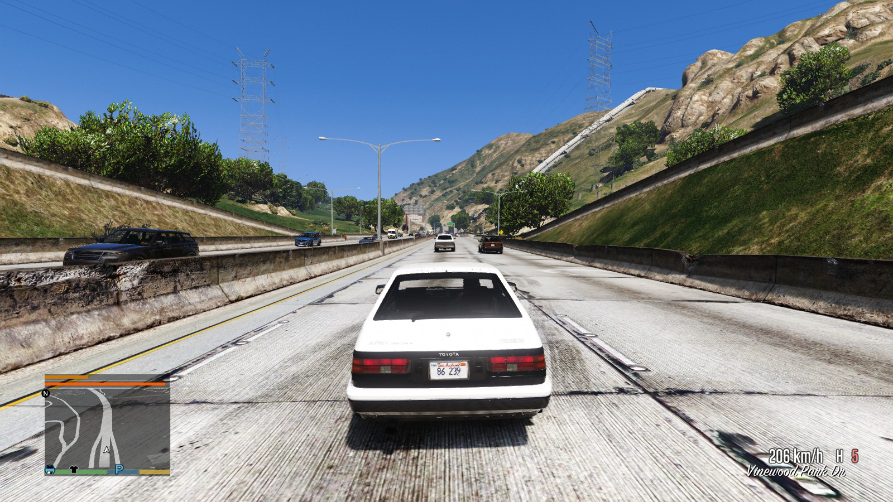
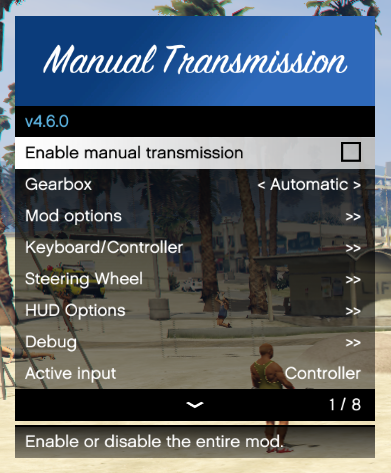
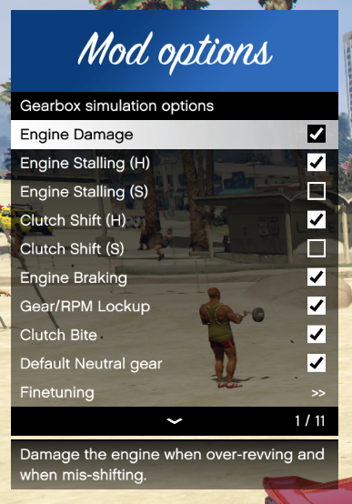
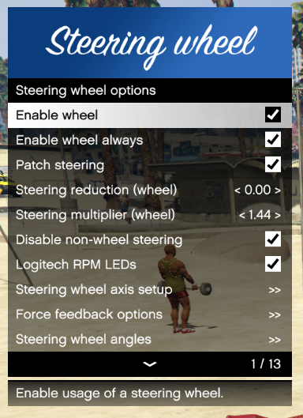
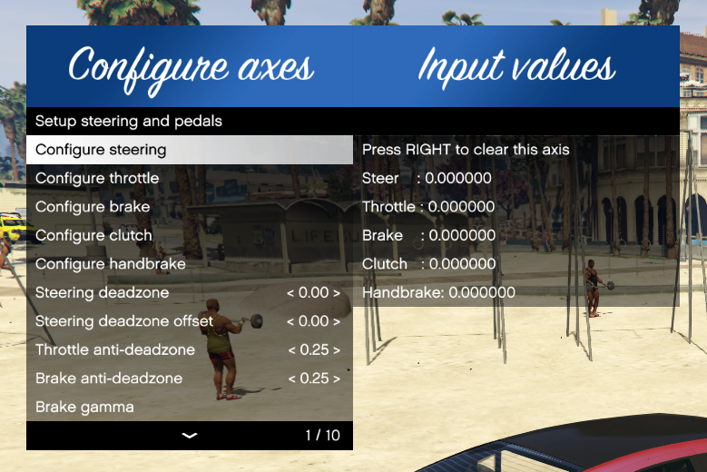

[comment]: # (User README.md)

# Manual Transmission and Steering Wheel Support for GTA V

Version 4.8.1

## Description

This mod adds manual transmission support, with loads of customization options
for the drivetrain and handling.

Fully supports steering wheels: It adds force feedback, works with about all
driving hardware, and every imaginable setting is customizable to fit
your wheel and driving style.

## Features

* Steering wheel, gamepad and keyboard support
* Seamless input switching
* Easy in-game configuration menu, with many options
* Per-vehicle settings
* Sequential, H-pattern and custom automatic transmissions
* Engine and transmission mechanics:
  * Working clutch
  * Engine braking, engine damage, stalling
  * Engine damage
  * Engine stalling
* Customizable steering assists
* Custom realistic Stability Control, Traction Control, Anti-Lock Brakes
* Supports UDP telemetry (DiRT 4 format) for SimHub and similar tools
* Syncronized steering animations

## Downloads

* [GTA5-Mods.com](https://www.gta5-mods.com/scripts/manual-transmission-ikt)
* [GitHub release (older versions)](https://github.com/E66666666/GTAVManualTransmission/releases)
* [Latest automated builds](https://ci.appveyor.com/project/E66666666/gtavmanualtransmission/build/artifacts)

## Table of Contents

* [Manual Transmission and Steering Wheel Support for GTA V](#manual-transmission-and-steering-wheel-support-for-gta-v)
  * [Description](#description)
  * [Features](#features)
  * [Downloads](#downloads)
  * [Table of Contents](#table-of-contents)
  * [Requirements](#requirements)
    * [Optional requirements (Downloads)](#optional-requirements-downloads)
  * [Installation and usage](#installation-and-usage)
    * [Optional requirements (Install)](#optional-requirements-install)
    * [Additional steps for wheel users](#additional-steps-for-wheel-users)
    * [FiveM installation (unsupported)](#fivem-installation-unsupported)
  * [Updating](#updating)
  * [Recommended mods](#recommended-mods)
  * [Default controls](#default-controls)
    * [Keyboard defaults (US-ANSI)](#keyboard-defaults-us-ansi)
    * [Controller defaults](#controller-defaults)
    * [Wheel defaults](#wheel-defaults)
    * [Input switching](#input-switching)
  * [Driving with Manual Transmission](#driving-with-manual-transmission)
  * [Troubleshooting](#troubleshooting)
    * [Compatibility](#compatibility)
    * [Known issues](#known-issues)
    * [Steering wheel issues](#steering-wheel-issues)
  * [Credits](#credits)
  * [Source code](#source-code)

## Requirements

* [Grand Theft Auto V](https://www.rockstargames.com/V/)
* [ScriptHookV](http://www.dev-c.com/gtav/scripthookv/)

### Optional requirements (Downloads)

* [DashHook](https://www.gta5-mods.com/tools/dashhook)
* [CamxxCore's DismembermentASI](https://www.gta5-mods.com/scripts/dismemberment)

## Installation and usage

Put `Gears.asi` and the folder `ManualTransmission` in your GTA V folder
 (overwrite when asked).

__Make sure the folder is writeable! (not `Read Only`)__

Open the menu using the `mtmenu` cheat or the `\|` hotkey, and start
customizing things.

### Optional requirements (Install)

* **DashHook**: Install as instructed by the mod page.
* **Dismemberment**: Place `DismembermentASI.asi` in your GTA V folder. It
is used by the custom first person vehicle camera.

### Additional steps for wheel users

0. Remove or disable any XInput or DirectInput input hook configurations for
your wheel for GTA V (x360ce, for example).
1. Open the menu, navigate to `Controls`, `Wheel & pedals`.
2. Open `Analog input setup` and set up your analog inputs (throttle, brakes, steering).
3. Go back to the `Wheel & pedals` menu and go through __all__ options. __Read the description of each option.__

### FiveM installation (unsupported)

1. Create a `plugins` folder in FiveM Application Data.
2. Put `Gears.asi` and the folder `ManualTransmission` in `plugins`.

You can also just copy-paste the `ManualTransmission` folder if you have
configured the mod for singleplayer already.

No further support is given for FiveM. If you want to convert this to FiveM,
I'm available for help. Otherwise, I'm not planning on converting it to or
integrating this script with FiveM.

## Updating

Replace `Gears.asi` and the folder `ManualTransmission` in your GTA V folder.
If the changelog indicated settings changed, you might want to
check the options. Otherwise it should be fine to keep your old settings.

## Recommended mods

* [Realistic Driving V](https://www.gta5-mods.com/vehicles/realistic-driving-v): Improves general car physics. Must-have if you have a force-feedback wheel, since it correctly reduces lateral grip to more realistic levels.
* [Custom Gear Ratios](https://www.gta5-mods.com/scripts/custom-gear-ratios): Essential if you have cars with more than 6 gears, and allows matching gear ratios with the real car counterparts.
[Autosport Racing System by Eddlm](https://www.gta5-mods.com/scripts/autosport-racing-system): Complete custom racing system with advanced AI.
* [Turbo Fix](https://www.gta5-mods.com/scripts/turbo-fix): Fixes spool rates of the turbo upgrade.
* [Dial Accuracy Fix](https://www.gta5-mods.com/scripts/dial-accuracy-fix): Remap dashboard dials to match your actual speed.
* [ACSPatch]: Keep wheels turned when exiting cars

Any speedometer supporting RPM/Gear reading from memory:

* [NFS Speedo](https://www.gta5-mods.com/scripts/nfsgauge-rpm-gear-speedometer)
* [LeFix Speedometer](https://www.gta5-mods.com/scripts/speedometer-improvedalexbladeversion)
* [NFSU Speedometer](https://www.gta5-mods.com/scripts/need-for-speed-underground-speedometer)

Mods that counter the power loss when sliding sideways (Also partially mitigated by LSD):

* [InversePower](https://www.gta5-mods.com/scripts/inversepower)
* [Drift Assist](https://www.gta5-mods.com/scripts/drift-assist)
* [True Realistic Driving V](https://www.gta5-mods.com/scripts/true-realistic-driving-v-realistic-mass-v0-1-beta)

## Default controls

Refer to `settings_controls.ini` for the default controls.

Opening the menu:

* Press `[{` to access the menu or
* Enter the `mtmenu` cheat or
* Press `RB` + `B` on your controller.

These shortcuts can be changed in `settings_menu.ini`.

 

### Keyboard defaults (US-ANSI)

By default, `W` and `S` are assigned to throttle and brake respectively.

* Press `\|` to disable or enable manual transmission
* Press `]}` to switch between sequential, H-pattern or automatic
* Press `Z` for Clutch
* Press `X` for Engine

Sequential and Automatic:

* Press `LSHIFT` to shift up
* Press `LCTRL` to shift down

H-shifter mode:

* Press `Numpad 0` for Reverse
* Press `Numpad 1-7` for H-shifter gears 1-7
* Press `Numpad 9` for Neutral

### Controller defaults

By default, `RightTrigger` and `LeftTrigger` are assigned to throttle and brake respectively.

* Hold `Dpad Right` to disable or enable manual transmission (disabled at the moment)
* Hold `B` to switch between sequential, H-pattern or automatic
* Press `A` to shift up
* Press `X` to shift down
* Use `LeftThumbUp` to control the clutch
* Press `DpadDown` for Engine

### Wheel defaults

There are no defaults. You need to use the menu to assign your controls.

### Input switching

The mod picks up the last control and is only active for that set of controls.
To switch between inputs (keyboard, controller or wheel), you only need to tap
 the throttle on that device. The mod automagically switches between these inputs.

Specifically for wheel users, you might need to fully depress the throttle
pedal or clutch pedal (once) if the mod keeps swapping away from the
 keyboard or controller.

If for some reason you want to lock the controls, head over to `Debug` and check
`Disable input detection`. This allows switching inputs manually in the main menu.

## Driving with Manual Transmission

Just like with literally any other non-automatic vehicle, you'll need to use
the clutch. If this is troublesome I recommend you to get familiar with your
average car.

__Stalling:__  Depending on your settings, you might or might not
need to operate the clutch to make a smooth start. Like a real vehicle, remember
to not let the RPM dip too low for the current gear. It might stall otherwise.

__Braking:__ To brake, press the brake/reverse key, button or pedal.
When coming to a halt, the vehicle will not reverse like the original game.

__Reversing:__ To reverse, shift into the reverse gear. Press the accelerator
key, button or pedal. Pressing brake only applies the brake.

All of this can feel unnatural if done on a controller or keyboard, but should
feel perfectly normal like a normal car when you use a wheel.

__Wheel-specific:__ While the *Manual Transmission* is active, the pedals behave
like real pedals. When the manual transmission part of the mod is turned off,
the throttle and the brake work like the left or right triggers on a controller.
Steering is still direct, and other car controls (blinkers, lights) still work.

## Troubleshooting

### Compatibility

The current version of the mod has been tested with GTA V version v1.0.1604.0
through v1.0.1868.4. Limited support runs back to v1.0.877.1, but new features
have been added since.

* ScriptHookV
* ScriptHookVDotNet
* RAGEPluginHook
* OpenIV
* FiveM

### Known issues

* __x360ce__ will conflict with input detection if throttle, brake, clutch or steering axes are mapped in x360ce. Assigning inputs without overlap is no problem.
* [__Strapped__](https://www.gta5-mods.com/scripts/pull-out-strap) will conflict with inputs.
* [__CustomSteering__](https://www.gta5-mods.com/scripts/custom-steering) will conflict with steering patching.
* [__ScriptHookVDotNet__](https://github.com/crosire/scripthookvdotnet/releases) crashes the Logitech G920.
  * Workaround: Disable ScriptHookVDotNet.
  * Workaround: Launch the game with RAGEPluginHook. (Found by BULLFAYCE)
* Steering wheel sticks to full left/full throttle.
  * Workaround: Re-toggle the script, prevent alt-tabbing while not paused.
* Wheel not detected at all when using Steam.
  * Fix: Uncheck `Generic Gamepad Configuration Support` in Steam Big Picture settings, Controller settings. (Found by Kaerali)

### Steering wheel issues

#### Strange values reported

Check if your wheel is recognized correctly, a recent Windows 10 update forces
new Logitech software which will mess up older Logitech steering wheels.

#### Steering wheel not detected

* Try toggling the mod (|\ key)
* Ensure you have removed xinput dlls from the GTA V directory
* [Tag me on this page](https://www.gta5-mods.com/scripts/manual-transmission-ikt) or any of the linked forum threads with a copy of `ManualTransmission\Gears.log`.

## Credits

A massive *Thank You* to everyone who contributed!

* [Rockstar Games](http://store.steampowered.com/app/271590/Grand_Theft_Auto_V/)
* [Alexander Blade](http://www.dev-c.com/gtav/scripthookv/)
* [Crosire](https://github.com/crosire/scripthookvdotnet)
* [LeFix](https://github.com/Le-Fix)
* [XMOD](https://www.gta5-mods.com/users/XMOD)
* [InfamousSabre](https://www.gta5-mods.com/users/InfamousSabre)
* [leftas](https://github.com/leftas/)
* [kagikn](https://github.com/kagikn)
* [zorg93](https://github.com/zorg93)
* [Unknown Modder](https://github.com/UnknownModder)
* [any333](https://www.gta5-mods.com/users/any333)
* [Nyconing](https://github.com/Nyconing)
* [CamxxCore](https://github.com/CamxxCore)
* [guilhermelimak](https://github.com/guilhermelimak)
* [Rbn3D](https://github.com/Rbn3D)
* [LeeC2202](https://gtaforums.com/profile/1170715-leec22/)
* All others who helped :)

## Source code

You can check the source code at
[https://github.com/E66666666/GTAVManualTransmission](https://github.com/E66666666/GTAVManualTransmission).

Feel free to make issues, PRs and other contributions :)
